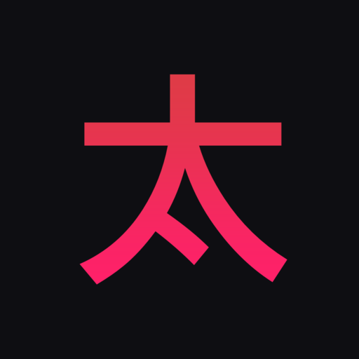
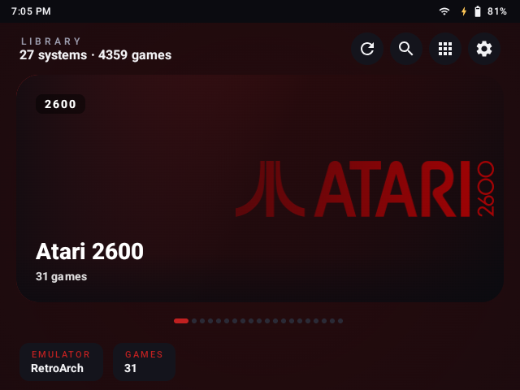
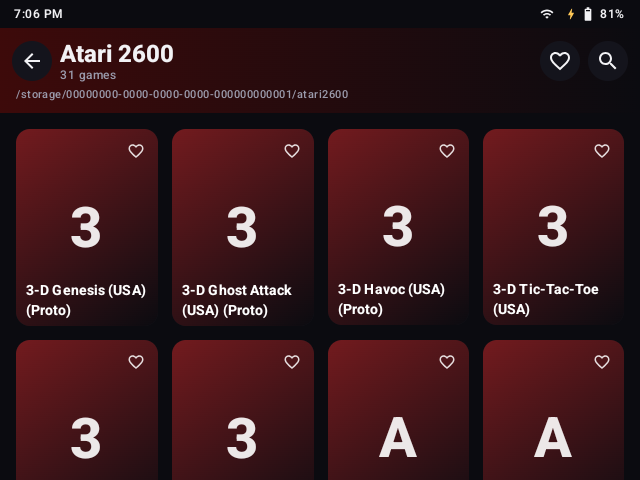
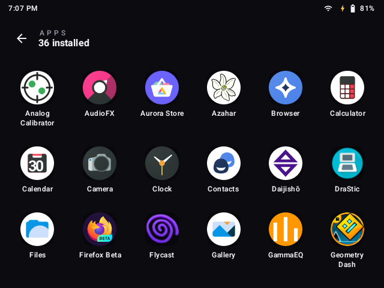
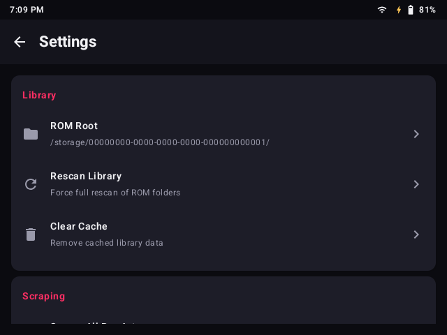

<p align="center">
  
</p>

<h1 align="center">Taizi</h1>

<p align="center">
  <b>A lightweight launcher & ROM library for Android handhelds</b>
</p>

<p align="center">
  <a href="https://github.com/cloudwithax/taizi/releases/latest">
    
  </a>
  <a href="https://github.com/cloudwithax/taizi/blob/main/LICENSE">
    
  </a>
  
  
  
</p>

<p align="center">
  <a href="#features">Features</a> •
  <a href="#screenshots">Screenshots</a> •
  <a href="#installation">Installation</a> •
  <a href="#rom-organization">ROMs</a> •
  <a href="#building">Building</a>
</p>

---

## Features

- **Rocknix-style library** — one folder = one system, auto-detected from 100+ known platforms
- **Adaptive launcher** — replaces your stock home screen with a game-focused app drawer
- **Box art scraping** — built-in IGDB metadata & cover download with Room database caching
- **Smart resuming** — skips ROMs that already have cached box art on disk
- **Multi-disc support** — `.m3u` playlists and multi-file games handled gracefully
- **BIOS checking** — warns when required firmware is missing
- **Real-time sync** — `FileObserver` watches your ROM folders for live updates
- **Dual-screen ready** — built for RG DS and similar clamshell Android handhelds
- **Tiny footprint** — ~4 MB APK, no bloat

## Screenshots

<p align="center">
  
  <br>
  <em>Library — browse systems with artwork and metadata</em>
</p>

<p align="center">
  
  <br>
  <em>Game list — view ROMs per system with favorites & search</em>
</p>

<p align="center">
  
  <br>
  <em>App drawer — launch installed apps with long-press actions</em>
</p>

<p align="center">
  
  <br>
  <em>Settings — configure ROM root, scraping, and cache</em>
</p>

## Installation

1. Download the latest APK from [Releases](https://github.com/cloudwithax/taizi/releases)
2. Enable **Install unknown apps** on your device
3. Install and launch — point it at your ROM root folder (e.g. `/storage/roms/`)
4. Set Taizi as your **default home app** when prompted

## ROM Organization

Taizi follows the Rocknix / JELOS folder convention:

```
/storage/roms/
├── gb/
│   ├── game1.gb
│   └── game2.gbc
├── gba/
│   ├── pokemon.gba
│   └── hacks/
│       └── hack.gba
├── nes/
├── snes/
├── n64/
├── psx/
├── psp/
├── nds/
├── dc/
├── mame/
├── pce/
└── bios/              ← optional BIOS folder
    ├── scph1001.bin
    └── gb_bios.bin
```

Unknown folders can be mapped to known systems in Settings.

## Supported Systems

Over **100 systems** are recognized out of the box, including:

| Nintendo | Sony | Sega | Arcade | Other |
|----------|------|------|--------|-------|
| Game Boy | PlayStation | Genesis / Mega Drive | MAME | PICO-8 |
| Game Boy Advance | PlayStation 2 | Master System | FinalBurn Neo | ScummVM |
| NES / Famicom | PSP | Game Gear | Capcom CPS-1/2/3 | DOS |
| SNES / Super Famicom | — | Saturn | Neo Geo | 3DO |
| Nintendo 64 | — | Dreamcast / NAOMI | — | Atari 2600/5200/7800 |
| GameCube / Wii | — | Mega CD / 32X | — | WonderSwan |
| Nintendo DS / 3DS | — | — | — | ZX Spectrum |
| Virtual Boy | — | — | — | Amiga |

## Emulator Support

Taizi launches games via standard Android intents. Supported frontends:

| Emulator | Systems | Package |
|----------|---------|---------|
| **RetroArch** | Most (via libretro cores) | `com.retroarch.aarch64` |
| **DuckStation** | PlayStation | `com.github.stenzek.duckstation` |
| **PPSSPP** | PSP | `org.ppsspp.ppsspp` |
| **DraStic** | Nintendo DS | `com.dsemu.drastic` |
| **Flycast** | Dreamcast / NAOMI | `com.flycast.emulator` |
| **melonDS** | Nintendo DS | `me.magnum.melonds` |
| **Azahar / Citra** | Nintendo 3DS | `org.azahar_emu.azahar` |
| **Dolphin** | GameCube / Wii | `org.dolphinemu.dolphinemu` |
| **Mupen64Plus FZ** | Nintendo 64 | `org.mupen64plusae.v3.fzurita` |
| **AetherSX2 / NetherSX2** | PlayStation 2 | `xyz.aethersx2.android` |

Per-system emulator selection is configurable in Settings.

## Building

### Prerequisites

- Android Studio Hedgehog (2023.1.1) or newer
- Android SDK API 35
- NDK r26+ (ARM64)
- Gradle 8.4+

### Build

```bash
./gradlew assembleRelease
```

The release APK will be at `app/build/outputs/apk/release/app-release.apk`.

## Scraping

1. Go to **Settings → Scraping**
2. Enter your [IGDB](https://igdb.com) credentials (free account required)
3. Tap **Scrape All** or scrape per-system

Scraped box art and metadata are stored in a local Room database (`taizi_boxart.db`) that is automatically removed on app uninstall.

## Troubleshooting

| Problem | Fix |
|---------|-----|
| ROMs not showing | Check ROM root path in Settings; reboot to force full scan |
| Game won't launch | Verify the emulator is installed; check ROM format support |
| No box art | Use the scraper or place images in `imgs/{system}/` next to ROMs |
| FileObserver stops | Android `inotify` limits may be exceeded; run a manual rescan |

## License

MIT License — see [LICENSE](LICENSE).

## Credits

- Inspired by [Daijishō](https://github.com/magneticchen/Daijishou) and [ROCKNIX](https://rocknix.org/)
- Built with [Jetpack Compose](https://developer.android.com/jetpack/compose), [Coil](https://coil-kt.github.io/coil/), [Room](https://developer.android.com/jetpack/androidx/releases/room), [Hilt](https://dagger.dev/hilt/)
